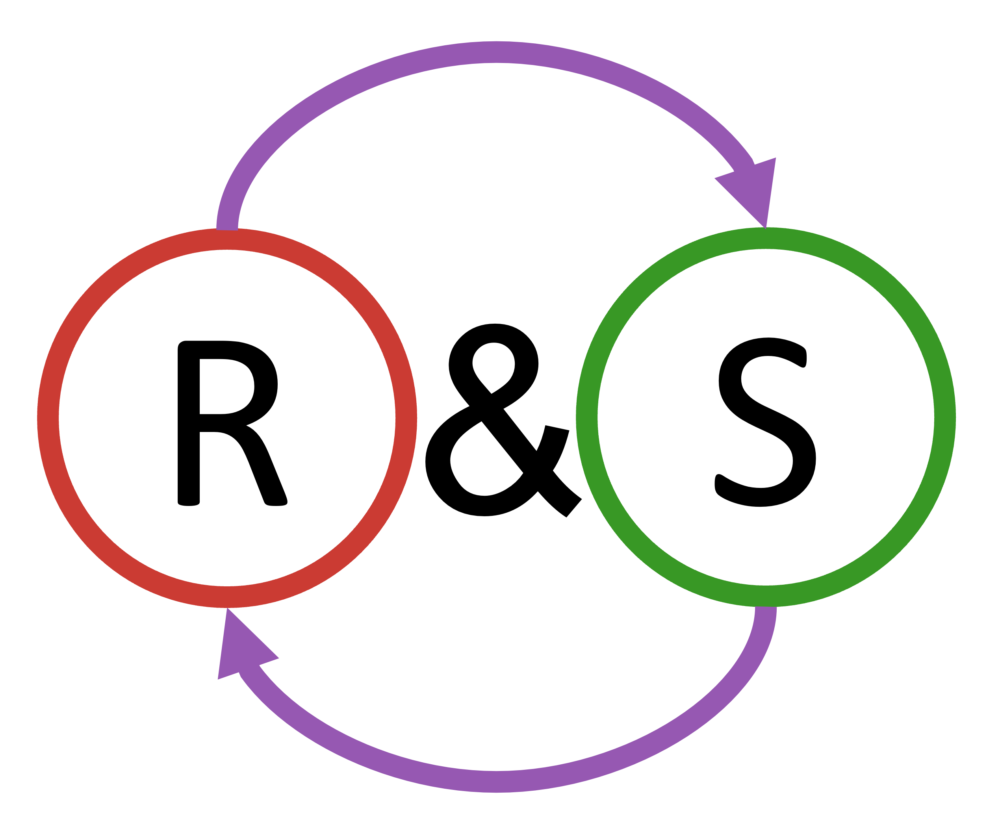

<p align="center">
  
</p>

# RoundAndSwap.jl

| **Documentation**                                                               | **Build Status**                                                                                |
|:-------------------------------------------------------------------------------:|:-----------------------------------------------------------------------------------------------:|
| [![][docs-stable-img]][docs-stable-url] [![][docs-dev-img]][docs-dev-url] | [![][GHA-img]][GHA-url] [![][codecov-img]][codecov-url] |


[docs-dev-img]: https://img.shields.io/badge/docs-dev-blue.svg
[docs-dev-url]: https://this-josh.github.io/RoundAndSwap.jl/dev/

[docs-stable-img]: https://img.shields.io/badge/docs-stable-blue.svg
[docs-stable-url]: https://this-josh.github.io/RoundAndSwap.jl/stable/

[GHA-img]: https://github.com/this-josh/RoundAndSwap.jl/actions/workflows/runtests.yml/badge.svg
[GHA-url]: https://github.com/this-josh/RoundAndSwap.jl/actions/workflows/runtests.yml

[codecov-img]: https://codecov.io/gh/this-josh/RoundAndSwap.jl/branch/main/graph/badge.svg?token=hfQGPZjl2y
[codecov-url]: https://codecov.io/gh/this-josh/RoundAndSwap.jl


`RoundAndSwap.jl` is a library which implements the Round and Swap algorithm, this implementation was inspired by Filippo Pecci's usage in [Bounds and Convex Heuristics for Bi-Objective Sensor Placement in Water Networks](https://arxiv.org/abs/2207.04897).


## Getting started

1.  Create your JuMP model, and optimize
```julia
# Define how many variables you want fixed
num_to_fix = 2

using JuMP, HiGHS
model = Model(HiGHS.Optimizer)
@variable(model, 0 ≤ a ≤ 1)
@variable(model, 0 ≤ b ≤ 1)
@variable(model, 0 ≤ c ≤ 1)
@variable(model, 0 ≤ d ≤ 1)
@constraint(model, a + b + c + d == num_to_fix)
@objective(model, Max, (a + b) + (2 * (b + c)) + (3 * (c - d)) + (4 * (d + a)))

# To demonstate functionality we will fix b and d
fix(b, 0.8; force=true)
fix(d, 0.8; force=true)

optimize!(model)
```
2. Identify which variable we are considering making `1`
```julia
consider_swapping = [a,b,c,d]
```

3. Round variables closest to `1`, this will be b and d as we fixed them at `0.8`.
```julia
using RoundAndSwap
round!(consider_swapping, num_to_fix)
```
4. Begin swapping
```julia
best_swap, swapper = swap(model, consider_swapping)
```
5. Review your best swap
```julia
julia> best_swap
1-element Vector{Swap}:
 Swap 
    existing:           b
    new:                a
    obj_value:          10.0          
    success:            true            
    all_fixed:          [:a, :c]          
    termination_status: OPTIMAL 
    solve_time:         0.0004438320000872409
    swap_number:        7
```
As you can see in this case we found the globally optimal solution of 10.
 *Note:* Round and Swap does not provide guarantees of global optimility.

### caveats

* Currently can only set variables to `0` or `1`.

## Performance

In testing I've done 536 swaps with `round_and_swap` taking 174.1 seconds with 172.8 seconds of that being in the optimizer, giving `RoundAndSwap.jl` an overhead of 0.75%.  


